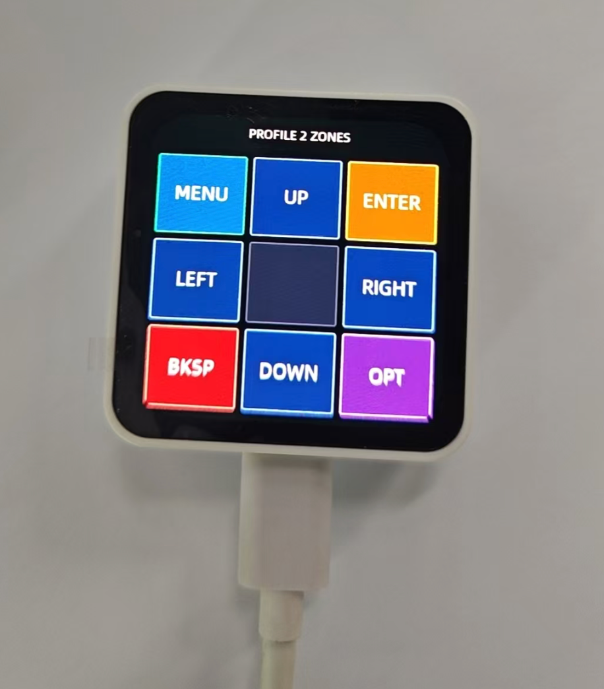

# XiaoZhi KB：小智语音 + 金山 AI 助手 + 蓝牙 HID 键盘

这是一个基于小智 ESP32 开源工程改造的 ESP32-C6 固件，目标硬件是 **Waveshare ESP32-C6-Touch-AMOLED-2.16**。它把同一块开发板做成多个可切换的应用：

- **小智语音模式**：保留小智原有语音助手能力。
- **金山 AI 助手模式**：点按一个主按钮完成说话、发送、暂停和继续；离线对话先存 SD，联网后通过持久 WSS 发送给 Agent，回复完整落卡并校验后自动播放。
- **蓝牙键盘模式**：作为 BLE HID 键盘连接 MacBook 等主机，支持实体键和触屏方向键。
- **开机选择界面**：通过触摸屏在小智语音 / 金山 AI / 蓝牙键盘之间选择。

此外还为整机增加了 **SD 卡（TF 卡）支持**：三种模式均可挂载 SD 卡，图片和对话音频等文件可直接存卡。键盘模式可启用日志落盘；小智和金山 AI 模式为避免任务栈溢出或 SPI2 冲突，日志只走 USB 串口。

项目当前已在真机上验证：SD 卡识别挂载、录音存 WAV、蓝牙键盘连接、触屏方向键、录音返回菜单稳定性和小智 Wi-Fi 启动稳定性均正常。

## 硬件目标

当前主要适配：

- 开发板：Waveshare ESP32-C6-Touch-AMOLED-2.16
- MCU：ESP32-C6
- 屏幕：2.16 英寸 AMOLED，480 x 480
- 触摸：CST9217，I2C
- 电源管理：AXP2101
- 蓝牙：BLE HID 键盘
- 串口：USB-Serial/JTAG，通常为 `/dev/cu.usbmodem1101`

重要硬件约束：

- ESP32-C6 只支持 BLE，不支持 Classic Bluetooth，所以键盘走 BLE HID。
- GPIO12 / GPIO13 是 USB D- / D+，不能改成普通 GPIO。
- 板上三个实体键的实际用途为：

| 位置 | 丝印 | 实际用途 | 当前固件行为 |
| --- | --- | --- | --- |
| 最左 | IO10 | GPIO10 普通按键 | 蓝牙键盘模式下按住为右 Option |
| 中间 | PWR | AXP2101 电源键 | 配置1单击为退格；配置2单击为 Tab；长按仍可能触发电源行为 |
| 最右 | BOOT | GPIO9 / BOOT 键 | 配置1单击为确定/回车；配置2单击切换触区图/黑屏 |

## 功能说明

### 1. 开机模式分派

固件启动后会读取 NVS：

- namespace：`appsel`
- key：`mode`
- 可选值：`selector`、`xiaozhi`、`keyboard`、`recorder`

分派规则：

- `mode=keyboard`：进入蓝牙键盘模式。
- `mode=xiaozhi`：进入小智语音模式。
- `mode=recorder`：进入金山 AI 助手模式（内部仍沿用 recorder 模式名）。
- NVS 为空、值非法或 `mode=selector`：进入开机选择界面。

相关代码：

- `main/main.cc`
- `main/apps/app_mode.cc`
- `main/apps/app_selector.cc`
- `main/apps/recorder/`（金山 AI 助手 app）
- `main/sdcard/`（SD 卡挂载与日志落盘）

### 2. 开机选择界面

选择界面直接运行在板载触摸屏上，显示三个入口：

- `XiaoZhi AI`：小智语音
- `Jinshan AI`：金山 AI 语音助手
- `Bluetooth KB`：蓝牙键盘

点击后会写入 NVS 并软重启，重启后进入对应模式。选择界面不启动 Wi-Fi、音频或 BLE，只初始化显示和触摸，启动成本较低。

### 3. 蓝牙键盘模式

蓝牙键盘模式会广播 BLE HID 设备：

- 设备名：`XiaoZhi KB`
- HID 类型：Keyboard
- VID / PID：`0x16C0 / 0x05DF`
- 配对方式：Just Works，无 PIN

选择界面提供两个蓝牙键盘配置：

> 说明：自金山 AI 助手加入后，开机选择界面把原「配置1」入口替换为「Jinshan AI」，
> 因此菜单当前只直接提供「配置2」。配置1 的键位实现仍保留在代码中
> （可通过写 NVS `mode=keyboard` + profile=1 进入），以下键位表供参考。

- **配置1**：保持原有键位。
- **配置2**：增加四角触区快捷键，BOOT 单击在触区图和黑屏之间切换。

配置1 键位：

| 输入 | 输出 |
| --- | --- |
| 最左键 GPIO10 按住 | 右 Option / Right Alt |
| BOOT 单击 | 确定 / 回车 |
| PWR 单击 | 退格 |
| 触摸屏上 / 下 / 左 / 右区域 | 键盘方向键上 / 下 / 左 / 右 |
| 触摸屏左上角长按 2 秒 | 返回开机选择界面 |

配置2 键位：

| 输入 | 输出 |
| --- | --- |
| 最左键 GPIO10 按住 | 右 Option / Right Alt |
| BOOT 单击 | 触区图 / 黑屏切换 |
| PWR 单击 | Tab |
| 触摸屏上 / 下 / 左 / 右区域 | 键盘方向键上 / 下 / 左 / 右 |
| 触摸屏左上角长按 2 秒 | 返回开机选择界面 |
| 触摸屏左下角 | 退格 |
| 触摸屏右上角 | 确定 / 回车 |
| 触摸屏右下角按住 | 右 Option / Right Alt |
| 触摸屏中间区域按住 | 左 Command |

触屏方向键和退格/回车触区支持按住重复发送，当前重复间隔约 120 ms。右下角右 Option 和中间左 Command 按触摸按住/松开处理。

配置2 的触区图使用英文缩写显示，避免中文字库占用和字形缺失问题：

| 屏幕位置 | 显示 | 动作 |
| --- | --- | --- |
| 左上 | `MENU` | 长按 2 秒返回选择界面 |
| 上 | `UP` | 方向键上 |
| 右上 | `ENTER` | 回车 |
| 左 | `LEFT` | 方向键左 |
| 中 | `CMD` | 按住左 Command |
| 右 | `RIGHT` | 方向键右 |
| 左下 | `BKSP` | 退格 |
| 下 | `DOWN` | 方向键下 |
| 右下 | `OPT` | 按住右 Option |

配置2 触区图真机效果（中间 `CMD` 区在实机上显示为默认底色）：



相关代码：

- `main/apps/ble_keyboard/keyboard_app.cc`
- `main/apps/ble_keyboard/ble_hid_keyboard.cc`
- `main/apps/ble_keyboard/keyboard_touch_arrows.cc`
- `main/apps/ble_keyboard/touch_arrow_mapper.cc`
- `main/apps/ble_keyboard/keyboard_touch_gesture.cc`
- `main/apps/ble_keyboard/keyboard_pmic_power_key.cc`

### 4. 小智语音模式

小智语音模式沿用原项目的 `Application` 主流程：

- 设备初始化
- 显示和音频
- 网络与协议
- 小智主循环

在小智语音模式下，BOOT 键长按 2 秒会写入 `mode=selector` 并重启，返回开机选择界面。

### 5. 金山 AI 语音助手模式

金山 AI 是一个独立应用（内部沿用 recorder 代码目录，不走小智 `Application`），自己初始化屏幕、音频 codec 和 SD 卡：

- 空闲时主按钮显示 `点击说话`，点按后进入 `正在聆听`；说完点 `发送` 保存并提交。录音期间实体键禁用。断网时仍可录音并显示 `已排队`，但一个 turn 完成前不接受第二次录音。
- 发送后界面依次显示 `正在发送`、`正在思考`、`准备回复` 和 `正在播报`；忙碌阶段主按钮禁用，避免重复提交。
- 回复完整落卡后自动播放。播放时同一主按钮切换为 `暂停` / `继续`，左键音量 +10，右键音量 -10（范围 0–100）。
- 点 `历史` 查看对话音频；同一 turn 显示为 `你` 和 `AI 回复`，旧 `/sdcard/rec/recN.wav` 显示为 `录音`。
- 在任意助手界面持续按住左上角 `MENU` 2 秒返回应用选择界面；短按不会退出，退出前会先收尾当前录音。
- 主界面使用静态 LVGL 组件，不启动 UI 动画或定时器；展示内容统一由纯状态模型生成。
- 中文界面复用小智 `puhui-common.ttf`，只将当前固定文案生成 24 px / 4 bpp 子集，避免把完整常用汉字库全部链接进固件。
- 每个 turn 存在 `/sdcard/agent/YYYYMMDD/<turn-id>/`，包含 `user.wav`、完成后才出现的 `assistant.wav` 和原子更新的 `turn.json`；完成索引追加到 `/sdcard/agent/turns.jsonl`。
- `历史` 菜单把同一 turn 的 `AI 回复` / `你` 音频相邻显示，并继续兼容原 `/sdcard/rec/recN.wav` 文件。
- 新录音和 Agent 回复均为 WAV（单声道 / 16bit / 16000Hz）；播放器同时兼容旧 24000Hz 文件。单次录音接近 4 MiB 时自动停止并安全收尾。
- 录音链路把 ES7210 的 24000Hz PCM 用小智同款 `esp_ae_rate_cvt` 转为 16000Hz，再按 10ms 帧调用 ESP-SR `ns_create` / `ns_process`，最后进行固定增益和限幅。
- Recorder 复用小智保存的 Wi-Fi，保持 TLS WebSocket 在线；上传和下载均限制为 4096 字节块。回复每块写入 SD 后才确认累计字节数，服务端收到确认后再发下一块。
- 所有完整 WAV 都校验 SHA-256。中断下载只留下不可播放的 `.part`，重启/重连时会清理并从服务端幂等重放；完整回复落卡后自动播放。
- FATFS 不允许 `rename()` 覆盖现有文件；状态和回复更新会先把旧正式文件交换为
  `.bak`，再发布已同步的 `.part`。掉电后可从备份 manifest 恢复，`.part` / `.bak`
  永远不会进入播放菜单。

Agent WSS 地址由 `CONFIG_AGENT_VOICE_URL` 配置，设备 bearer token 只写入被 Git 忽略的本地 `sdkconfig`；源码、README 和提交中不得出现真实 token。因 ESP32-C6 只有 USB-Serial-JTAG、无 USB-OTG，**无法把 SD 卡模拟成 U 盘**，需要通过读卡器或受控串口工具检查文件。

相关代码：

- `main/apps/recorder/recorder_app.cc`
- `main/apps/recorder/recorder_display.cc`
- `scripts/verify_agent_voice_runtime.py`（至少监听 30 秒，不主动复位设备）
- `docs/recorder-design-guardrails.md`（录音新功能设计前必读，记录 SPI2 / ESP-SR 真机坑）

### 6. SD 卡挂载与日志策略

- **挂载**：`main/sdcard/sdcard.cc` 提供 `SdCardMount(bool own_spi_bus)`，SPI 模式挂载到 `/sdcard`。
  SD 卡与 AMOLED 屏共用 SPI2 总线：小智模式复用屏幕已建总线（`own_spi_bus=false`），
  键盘 / 录音模式按需自建或复用。挂载后有开机读写自检。
- **录音模式特别注意**：AMOLED 屏和 SD 卡共用 SPI2，录音模式在 SD 大块读写时必须暂停 LVGL 刷屏；
  recorder 模式也不要启用 SD 日志落盘，否则任意日志写卡都可能与屏幕刷新并发。
- **小智模式特别注意**：禁止调用 `SdCardLogStart()`。Wi-Fi 扫描日志来自只有 2304 字节栈的
  `sys_evt` 任务；现有同步 hook 会在该任务内执行 `vsnprintf`、FATFS 和 `fwrite`，导致
  `Stack protection fault`。小智仍会挂载 SD 卡，但日志只走 USB 串口。
- **键盘模式日志落盘**：`main/sdcard/sdcard_log.cc` 通过 `esp_log_set_vprintf` 把日志在串口输出的同时
  写入 `/sdcard/log/bootN.log`（去 ANSI 色码、限流、写失败自动降级）。不要把该同步 hook 直接复用到
  小智或录音模式；若将来需要全模式落盘，应改为有界队列和独立日志任务。
- **图片等文件**：卡挂载后 `/sdcard` 即标准 FATFS，可直接用文件接口存取；与固件的 assets 分区
  （flash 内存映射）互不影响。
- 已启用 FATFS 长文件名（`CONFIG_FATFS_LFN_HEAP`），否则只支持 8.3 短文件名、长文件名会写入失败。

## 目录结构

项目关键目录如下：

```text
.
├── main/
│   ├── main.cc                         # 固件入口，按 NVS 模式分派应用
│   ├── apps/
│   │   ├── app_mode.*                  # 模式读写和重启
│   │   ├── app_selector.*              # 触屏开机选择界面
│   │   ├── ble_keyboard/               # BLE HID 键盘应用
│   │   └── recorder/                   # 金山 AI 助手（录音、传输、播放）
│   ├── sdcard/                         # SD 卡挂载与日志落盘
│   ├── boards/                         # 各硬件板级适配
│   ├── display/                        # 显示抽象和 LVGL 显示实现
│   ├── protocols/                      # 小智协议实现
│   └── assets/                         # 语音、图片、语言资源
├── partitions/                         # 分区表
├── scripts/                            # 构建、资源、诊断辅助脚本
├── sdkconfig.defaults.esp32c6          # ESP32-C6 默认配置
└── CMakeLists.txt
```

## 开发环境

已验证环境：

- ESP-IDF 5.5
- 目标芯片：ESP32-C6
- macOS 开发机

初始化环境：

```bash
source ~/esp/esp-idf/export.sh
cd ~/xiaozhi-kb
idf.py set-target esp32c6
```

## 构建与烧录

完整构建：

```bash
source ~/esp/esp-idf/export.sh
cd ~/xiaozhi-kb
idf.py build
```

烧录到真机：

```bash
idf.py -p /dev/cu.usbmodem1101 flash
```

串口监听：

```bash
idf.py -p /dev/cu.usbmodem1101 monitor
```

如果端口不同，先查看当前 USB 串口：

```bash
ls /dev/cu.usbmodem*
```

## 首次使用

1. 编译并烧录固件。
2. 设备启动后，如果 NVS 里没有有效模式，会显示选择界面（`Select App`）。
3. 在屏幕上点击想进入的应用：`XiaoZhi AI` / `Jinshan AI` / `Bluetooth KB`。
4. 设备写入 NVS 并重启，进入对应模式。
5. **金山 AI**：点 `点击说话` 开始、说完点 `发送`，turn 存到 `/sdcard/agent/`；联网后 AI 回复落卡并自动播放，左上角 `MENU` 长按 2 秒退出。
6. **蓝牙键盘模式**：在 macOS 蓝牙设置中连接 `XiaoZhi KB`，然后测试：
   - 最左键按住：右 Option。
   - BOOT 单击切换触区图/黑屏，PWR 单击 Tab，左下角退格，右上角回车，中间按住左 Command，右下角按住右 Option。
   - 触摸屏左上角长按 2 秒返回选择界面。

## 模式切换

从选择界面进入应用：

- 点 `XiaoZhi AI` 进入小智语音模式。
- 点 `Jinshan AI` 进入金山 AI 语音助手模式。
- 点 `Bluetooth KB` 进入蓝牙键盘模式（配置2）。

各模式返回选择界面：

- 蓝牙键盘模式：触摸屏左上角长按 2 秒。
- 小智语音模式：BOOT 键长按 2 秒。
- 金山 AI 模式：屏幕左上角 `MENU` 长按 2 秒。

返回选择界面后，再点击另一个应用即可切换模式。

## 测试

仓库内包含几个可在主机上直接编译运行的小测试，用于验证不依赖硬件的纯逻辑：

```bash
c++ -std=c++17 -Wall -Wextra -Werror \
  -I main/apps/ble_keyboard \
  main/apps/ble_keyboard/touch_arrow_mapper_test.cc \
  main/apps/ble_keyboard/touch_arrow_mapper.cc \
  -o /tmp/touch_arrow_mapper_test && /tmp/touch_arrow_mapper_test

c++ -std=c++17 -Wall -Wextra -Werror \
  -I main/apps/ble_keyboard \
  main/apps/ble_keyboard/keyboard_touch_gesture_test.cc \
  main/apps/ble_keyboard/keyboard_touch_gesture.cc \
  -o /tmp/keyboard_touch_gesture_test && /tmp/keyboard_touch_gesture_test

c++ -std=c++17 -Wall -Wextra -Werror \
  -I main/apps/ble_keyboard \
  main/apps/ble_keyboard/keyboard_touch_action_test.cc \
  main/apps/ble_keyboard/keyboard_touch_action.cc \
  main/apps/ble_keyboard/touch_arrow_mapper.cc \
  main/apps/ble_keyboard/keyboard_touch_gesture.cc \
  -o /tmp/keyboard_touch_action_test && /tmp/keyboard_touch_action_test

c++ -std=c++17 -Wall -Wextra -Werror \
  -I main/apps/ble_keyboard \
  main/apps/ble_keyboard/keyboard_pmic_power_key_test.cc \
  main/apps/ble_keyboard/keyboard_pmic_power_key.cc \
  -o /tmp/keyboard_pmic_power_key_test && /tmp/keyboard_pmic_power_key_test

c++ -std=c++17 -Wall -Wextra -Werror \
  -I main/apps/recorder \
  main/apps/recorder/recorder_control_state_test.cc \
  main/apps/recorder/recorder_control_state.cc \
  -o /tmp/recorder_control_state_test && /tmp/recorder_control_state_test

c++ -std=c++17 -Wall -Wextra -Werror \
  -I main/apps/recorder \
  main/apps/recorder/recorder_display_area_test.cc \
  main/apps/recorder/recorder_display_area.cc \
  -o /tmp/recorder_display_area_test && /tmp/recorder_display_area_test

c++ -std=c++17 -Wall -Wextra -Werror \
  -I main/apps/recorder \
  main/apps/recorder/recorder_rate_converter_test.cc \
  main/apps/recorder/recorder_rate_converter.cc \
  -o /tmp/recorder_rate_converter_test && /tmp/recorder_rate_converter_test

c++ -std=c++17 -Wall -Wextra -Werror \
  -I main/apps/recorder \
  main/apps/recorder/recorder_noise_reducer_test.cc \
  main/apps/recorder/recorder_noise_reducer.cc \
  main/apps/recorder/recorder_rate_converter.cc \
  -o /tmp/recorder_noise_reducer_test && /tmp/recorder_noise_reducer_test

c++ -std=c++17 -Wall -Wextra -Werror \
  -I main/apps/recorder \
  main/apps/recorder/recorder_playback_menu_test.cc \
  main/apps/recorder/recorder_file_list.cc \
  main/apps/recorder/recorder_wav_file.cc \
  -o /tmp/recorder_playback_menu_test && /tmp/recorder_playback_menu_test
```

完整固件验证仍以 `idf.py build` 和真机烧录测试为准。

两个稳定性回归脚本只监听串口，不主动复位设备。它们使用本板已验证安全的 `dtr=True / rts=False` 线状态：

```bash
/tmp/ser-venv/bin/python scripts/verify_selector_stability.py --duration 6
/tmp/ser-venv/bin/python scripts/verify_xiaozhi_stability.py --duration 15
```

- 选择器脚本检查 `spi_hal_setup_trans` 断言和重复进入 selector。
- 小智脚本检查 `Stack protection fault`、重复进入小智和 `SdCardLogVprintf` 崩溃回溯。

## 2026-07-11 故障复盘与防回归

### 录音模式返回菜单后持续闪屏

- **现象**：长按 `MENU` 返回选择界面后，屏幕不断闪烁。
- **串口证据**：每次启动约 0.7 秒出现 `spi_hal_setup_trans` 断言，随后软件重启。
- **根因**：目标板构造函数创建 AMOLED/LVGL 后立即调用 `SdCardMount(false)`；LVGL 首帧与 SDSPI 初始化同时操作共享 SPI2。
- **修复**：挂载 SD 卡前执行 `lvgl_port_stop()` 并取得 `lvgl_port_lock()`，挂载结束后解锁并恢复 LVGL。
- **验证**：`scripts/verify_selector_stability.py` 从修复前 3 秒内 4 次崩溃变为 6 秒内 0 崩溃、0 重启。

### 小智 AI 不断重复加载

- **现象**：小智启动、扫描 Wi-Fi 后重新加载，循环发生。
- **串口证据**：`sys_evt` 任务发生 `Stack protection fault`，回溯包含 `SdCardLogVprintf()`、`vfs_fat_write()` 和 `ff_mutex_take()`。
- **根因**：`sys_evt` 任务栈为 2304 字节，现有 `esp_log_set_vprintf` hook 在产生日志的任务内同步格式化并写 FATFS，Wi-Fi 扫描日志将栈压穿。
- **修复**：小智模式继续挂载 SD 卡，但不安装 `SdCardLogStart()`；日志改为只走 USB 串口。录音文件保存不受影响。
- **验证**：`scripts/verify_xiaozhi_stability.py` 修复前稳定复现 `xiaozhi_boots=2 / stack_faults=1`，修复后连续监控 15 秒为 0 栈故障、0 重启。

## 常见问题

### 1. 为什么键盘只做 BLE HID？

ESP32-C6 没有 Classic Bluetooth，只能使用 BLE。当前实现基于 ESP-IDF 的 `esp_hid` BLE HID 能力。

### 2. 为什么 PWR 键要特殊处理？

PWR 不是普通 GPIO，而是接在 AXP2101 PMIC 上的电源键。固件通过读取 AXP2101 短按中断来识别单击；配置1映射为退格，配置2映射为 Tab。长按 PWR 仍可能触发硬件电源行为，调试和日常使用时不要把它当成长按功能键使用。

### 3. 为什么自动复位后看起来没有正常启动？

这块板在某些 DTR/RTS 自动复位序列下可能停在 ROM download/stub 状态。遇到黑屏、无日志或端口异常时，优先做真正断电冷启动：

```text
拔 USB -> 拔锂电池 -> 等 20 秒 -> 不按 BOOT -> 重新插 USB / 接电
```

### 4. 如何进入下载模式？

```text
拔 USB -> 拔锂电池 -> 等 20 秒 -> 按住 BOOT -> 插 USB -> 保持 BOOT 约 3 秒
```

### 5. 为什么不能动 GPIO12 / GPIO13？

GPIO12 和 GPIO13 是 ESP32-C6 的 USB D- / D+。把它们配置成普通 GPIO 会破坏 USB 通信，可能导致串口消失。

### 6. 为什么小智模式不再把日志写入 SD 卡？

现有 `SdCardLogVprintf()` 是同步 hook，会在 Wi-Fi `sys_evt` 等产生日志的任务栈内执行 FATFS 写入。该任务栈只有 2304 字节，真机已确认会发生栈保护故障。SD 卡仍正常挂载；禁用的只是小智模式日志落盘。

### 7. 菜单闪屏时应该先看什么？

先安全监听串口并检查是否出现 `spi_hal_setup_trans`。如果存在，说明共享 SPI2 上的 AMOLED 与 SD 卡发生了未仲裁并发；不要先调整亮度、刷新率或动画掩盖重启症状。

## 当前状态

已完成并验证：

- 开机选择界面。
- NVS 模式保存和启动分派。
- 小智语音模式入口。
- 蓝牙 HID 键盘广播和连接。
- GPIO10 右 Option。
- BOOT 在配置1单击回车，在配置2单击切换触区图/黑屏。
- PWR 在配置1单击退格，在配置2单击 Tab；退格真机验证无连发。
- 触屏方向键和配置2四角/中心快捷触区。
- 蓝牙键盘模式下触屏左上角长按返回选择界面。
- 小智模式下 BOOT 长按返回选择界面。
- SD 卡（TF 卡）识别与挂载，三种模式均可用；开机读写自检。
- 键盘模式可把系统日志落盘到 `/sdcard/log/bootN.log`；小智和录音模式日志走 USB 串口。
- 独立金山 AI 模式：单一主按钮完成 `点击说话` / `发送` / `暂停` / `继续`，用户和 AI WAV 存到 `/sdcard/agent/`，完整回复自动播放，左上角 `MENU` 长按退出。
- 录音返回菜单的 SPI2 重启循环已修复，并有串口稳定性脚本防回归。
- 小智 Wi-Fi 扫描阶段的 `sys_evt` 栈溢出已修复，并有串口稳定性脚本防回归。
- 录音软件增益 + 削波保护；WAV 和清单均持久化到 SD，传输中断可在重连后幂等恢复。

仍需注意：

- 本项目当前主要面向 Waveshare ESP32-C6-Touch-AMOLED-2.16；其他板型可能需要调整板级配置、触摸方向和电源管理逻辑。
- 键盘模式没有完整 UI，屏幕主要用于触摸方向键和返回选择界面。
- 若修改分区、OTA 或 NVS 逻辑，务必同时验证冷启动和模式切换。

## 许可

本仓库基于上游小智 ESP32 工程改造，保留原项目许可文件。新增改动遵循仓库现有许可约定。
